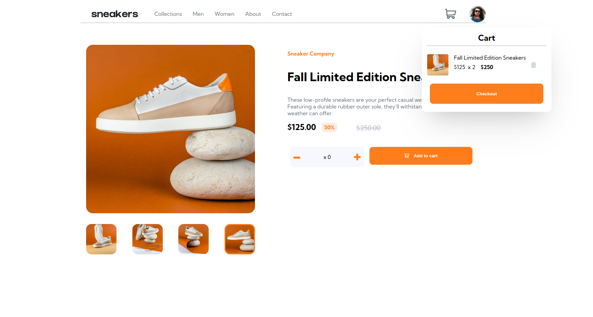
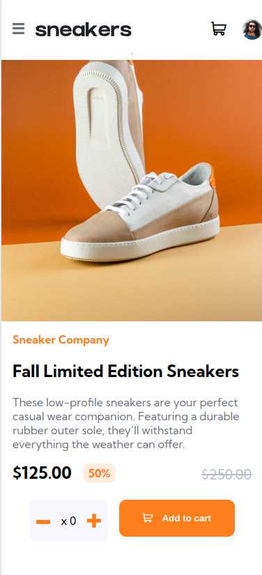

# Frontend Mentor - E-commerce product page solution

This is a solution to the [E-commerce product page challenge on Frontend Mentor](https://www.frontendmentor.io/challenges/ecommerce-product-page-UPsZ9MJp6). Frontend Mentor challenges help you improve your coding skills by building realistic projects.

## Table of contents

- [Overview](#overview)
  - [The challenge](#the-challenge)
  - [Screenshot](#screenshot)
  - [Links](#links)
- [My process](#my-process)
  - [Built with](#built-with)
  - [What I learned](#what-i-learned)
  - [Continued development](#continued-development)

- [Author](#author)
- [Acknowledgments](#acknowledgments)

**Note: Delete this note and update the table of contents based on what sections you keep.**

## Overview

### The challenge

Users should be able to:

- View the optimal layout for the site depending on their device's screen size
- See hover states for all interactive elements on the page
- Open a lightbox gallery by clicking on the large product image
- Switch the large product image by clicking on the small thumbnail images
- Add items to the cart
- View the cart and remove items from it

### Screenshot

### Links

- Solution URL: [Add solution URL here](https://your-solution-url.com)
- Live Site URL: [Ecommerce Stie](https://lukeschwade.github.io/Ecommerce-Product-Page/)

## My process

### Built with

- Semantic HTML5 markup
- CSS custom properties
- Flexbox
- CSS Grid
- Mobile-first workflow
- SASS

### What I learned

- How to create icons and use them as a fontsheet (NOT A FAN)
- How to import fonts online via google's font API (You don't need to declare font face when importing as it's already done)
- How to create an object associated with each item in the cart that stores important keys and has associated eventlisteners
- Dropdown menu implementation in CSS
- Implementation of a gallery lightbox using JS
- You can use Chrome Devtools to create a live-expression which is incredible for bugfixing and keeping track of variables
- The horrors of weakly typed languages

### Continued development

I'm really interested in the underlying mechanics of how the server communicates with client when doing something like a shop, and when, going to explore that although that's in the realm of non-static I guess.

## Author

- Website - [github](https://github.com/lukeSchwade)

## Acknowledgments

Many thanks to Pratham for letting me rubbery ducky explain the cart functionality to someone